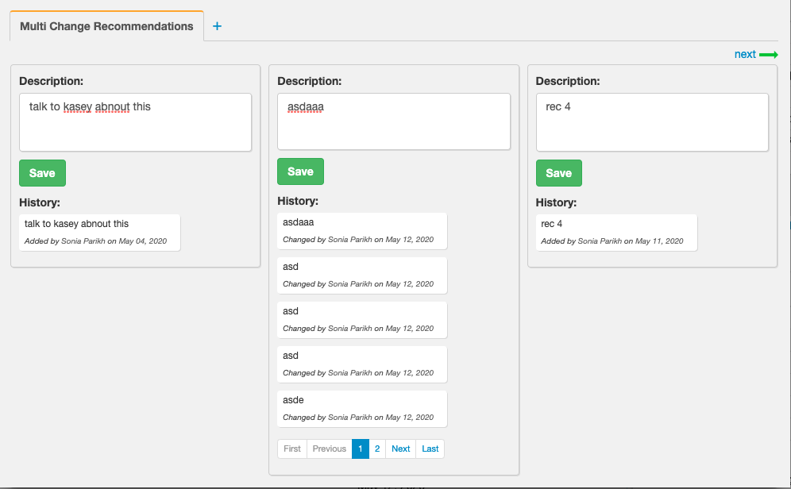

# HealthBrain


* [Why write a new patient file app?](#why-write-a-new-patient-file-app)
* [Why does the patient app have a left side and a right side?](#why-does-the-patient-app-have-a-left-side-and-a-right-side)
* [Why does the left side have two tabs on the top right corner?](#why-does-the-left-side-have-two-tabs-on-the-top-right-corner)
* [Why does the 2nd page have prev and next?](#why-does-the-2nd-page-have-prev-and-next)
* [What is the migration plan?](#what-is-the-migration-plan)
* [What is the ideal component on which other components are based?](#what-is-the-ideal-component-on-which-other-components-are-based)
* [What is needed to write a new component?](#what-is-needed-to-write-a-new-component)
* [What tags are used in code?](#what-tags-are-used-in-code)
* [What is the code review process?](#what-is-the-code-review-process)
* [How to run the app locally?](#how-to-run-the-app-locally)
* [How to see app behavior when DB connection is lost?](#how-to-see-app-behavior-when-db-server-connection-is-lost)
* [How to see app behavior when DB takes 10 seconds for API response?](#how-to-see-app-behavior-when-db-server-takes-10-seconds-for-api-response)

## Why write a new patient file app?

* Be atleast as good as paper
* [Go out of the way of patient doctor relationship](https://khn.org/news/death-by-a-thousand-clicks/)


## Why does the patient app have a left side and a right side?

Left side shows the state of the patient on a particular date.


 Right side is to change the current state of the patient.


Psychiatrist needs to be able to look at multiple historical states to make decisions and change the current state.

## Why does the left side have two tabs on the top right corner?
The 1st tab shows the health components and the 2nd tab shows the non-health components. There is a master table of components. And each component is either a health component or a "not-health" component.


## Why does the 2nd page have prev and next?




## What is the migration plan?
We get rec and rem component to work completely in the new architecture. Once they are cerifited then 10 developers are given the responsibility of delivered 5 components each week.

Within 2 weeks /p2 will get released once the architecture is finalized

## What is the ideal component on which other components are based?
Recommendation.

## What is needed to write a new component?

For the model component RecommendationsCard the following files needed to be created:

## Client side
1. vue-client/src/components/RecommendationsCard.vue file    -> This has the presentation layer (html), styling layer (css), JS to change the state. This file is compiled into seperate html js and css by vue-cli
2. vue-client/store/modules/recommendation.js               -> Vue state of this component. Mutation functions to state. Socket functions to change state.

## Server side
1. node-server/models/database/recommendation.database.js   -> Sequalize connection details
2. node-server/models/recommendation.model.js               -> Sequalize sql structure of this component
3. node-server/routes/recommendation.route.js               -> Routes of this component and emit socket messages

**Todo** 

How to keep these files in a seperate repo. How to run them independently.
Possible solution:
1. https://github.com/teambit/bit


## What tags are used in code?

 * Todo
 * Question
 * Fix

To find files with Fix tag: 

healthbrain> grep -ir -n --exclude-dir={node_modules,.git} ' Fix' ./

## What is the code review process?
https://www.youtube.com/watch?v=8fx-EaOUK2E

## How to run the app locally?

```bash
git clone https://github.com/savantcare/healthbrain.git

/healthbrain> docker-compose -f docker-compose-dev.yml up -d
```

Give enough time for npm install to work:

```bash
/healthbrain> docker logs healthbrain_vue_1 -f
/healthbrain> docker logs healthbrain_node_1 -f
```

Once the install finishes then:
```
In 3 incognito tabs open
http://localhost:81/phpmyadmin/      admin              : WUy3OsU5BYMM
http://localhost:8080/login          user1@gmail.com    : 123
http://localhost:8080/login          user1@gmail.com    : 123
```

## How to see app behavior when DB server connection is lost?
The mysql server is run from docker (See node-server/README.md)

Use the web app and then 

$ docker stop [container-name-of-mysqld]

Now refresh the web app.

The data will come from localstorage but you will toast message saying:

"Filed to get "component name" data"

This works using try catch examples
1. [For recommendations](file:///gt/sc-prog-repos/healthbrain/vue-client/src/store/modules/recommendation.js#221)
1. [For reminder](file:///gt/sc-prog-repos/healthbrain/vue-client/src/store/modules/reminder.js#221)

To put the system back:
$ docker start [container-name-of-mysqld]


## How to see app behavior when DB server takes 10 seconds for API response?

### Scenario 1:

Refresh the browser page. The UI wsill show data immediately from local storage using [vuex-persistance.](https://github.com/robinvdvleuten/vuex-persistedstate)

After 10 seconds when API returns a value UI will update.

In this case we saved the doctor 10 seconds.

### Scenario 2:

On the UI discontinue a rex. 

Inside database.json it will not say Discontinue:true UI will continue to show it as discontinued. 

After 10 seconds database.json will show Discontinue:true. 

In this case the app was able to give doctor 10 second faster response.

### Scenario 3:

The web page shows the current list of recommendations

Edit node-server/database.json and change the description of a recommendation.

Reload the page

The web page should show the edited recommendation.

Status: Fail

## How to test the PWA app?
pwa app does not run from localhost. So the following steps needs to be followed:

We can test PWA app by install the following chrome extension:
https://chrome.google.com/webstore/detail/web-server-for-chrome/ofhbbkphhbklhfoeikjpcbhemlocgigb

## Mins of meeting

### 18th May 2020

1. No need to improve current scBrain, laravel and Panel code since after 2 years the app will not remain in angular 1.6 hence it makes sense to write it again in Vue. 

2. UI needs to only use Bootstrap to maintain consistency. No need to bring code into bootstrap since new VUE app will do it.

A. In new VUE app the left and right frame sizes will be adjustable by dragging

B. Use https://phppot.com/css/automatic-column-hiding-using-css-in-responsive-table/ to change the number of columns being displayed based on priority.

C. Use responsive divs so that when right side is made wider the cards can go beside each other. https://www.w3schools.com/howto/tryit.asp?filename=tryhow_css_two_columns_responsive

3. When write in VUE first develop the left frame. EMR customizer shows 44 components.

4. RnD needs to be done on how the panel and frame can remain seperate apps and still share vuex. Since the current angular app has many advantages of being 2 seperate app running as 1. 

Whole world runs app in one frame. Hence decided to stick with conventional wisdom.

5. RnD needs to be done on each component to be in its own repo. Why? So that when recommendation component code needs to be sent to prod it does not need other git repos to be updated.

How to do it?
https://github.com/teambit/bit 11K stars tutorial: https://codeburst.io/how-to-share-reusable-vue-components-between-a-c36bc775418d 


6. I should be able to run the complete app just with one repo. So during development I have a simpler environment to develop the app.

In Vue there is a system to choose which components to load. That will be used. Postponed for time being.

7. Current development rule

Bug fixes or new feature requested by doctor -> Existing angular app 

Remaining developer resources will be given to VUE app.