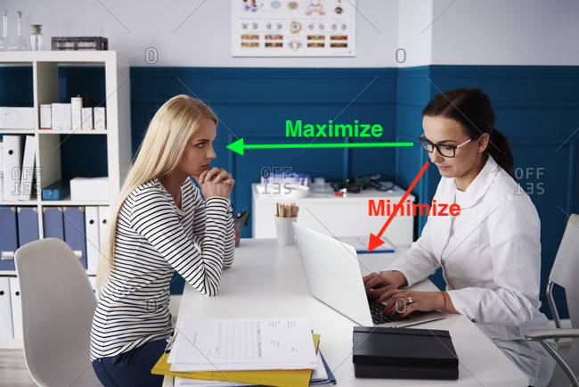
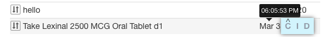
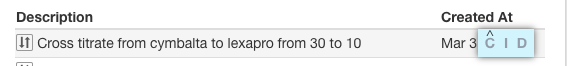
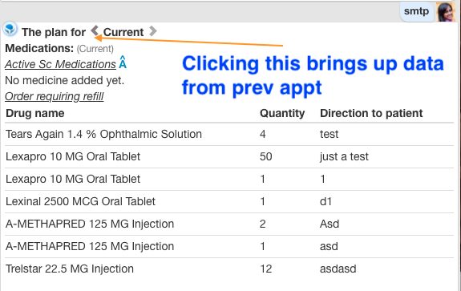
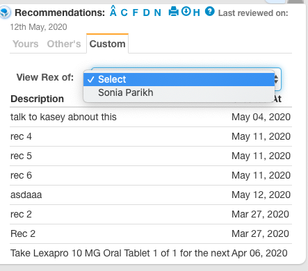

# What is the core problem?

# How to sovle the core problem?

A. [Optimize doctor time to gather information (visual density)](#how-to-optimize-doctor-time-to-gather-information-visual-density)

B. [Optimize doctor time to Change information (shortest hand movement)](#how-to-optimize-doctor-time-to-change-information-shortest-hand-movement)

# How to optimize doctor time to gather information (visual density)?

1. Tabbed tables -> In the above screenshot there are three tables 1. "Your recommendations" 2. "Others recommendations" and 3. "Custom"

   Each tab is a table component. And the tabs are displayed using Vue’s <component> element with the is special attribute:
   https://vuejs.org/v2/guide/components.html#Dynamic-Components

2. Responsive tables https://elvery.net/demo/responsive-tables/ -> 

    Less important columns are hidden and that data is sent to tooltip. For e.g. in case of recommendations -> Created at is less important column and it can be hidden when width is less. The content of created at is shown as tooltip when mouse is taken over the first column.

3. Each cell may have additional data passed in the Json to show in a tooltip

    
        
    Reason: 99% of the time date of recs added is enough. For the hour and time of rex added the data 		sent in json is shown in a tooltip.

4. The actions are shown as a overlay

    
    
    Reason: If there are 10 data rows with 5 actions each. We do not want to show 50 action icons. The first 		look is clean. When doctor gets into the context of working on a data row only then 5 action icons are 		shown.

5. Data table previous appointment state can be recalled. 

    
    
    Client side data query is done through https://github.com/vuex-orm/vuex-orm using https://github.com/vuex-orm/plugin-axios

6. Filter on a column not visible    

   

    In the above use case Dr. Parikh is interested in recommendations made to this patient by Dr. Savant.

7. Column header to have tooltip. Since at times the column header is abbreviated to optimize visual density.

8. Data comes sorted in prioritization done by doctor. "Created on" has a sort so doctor can see latest recommendations.

# How to optimize doctor time to change information (shortest hand movement)?

1. Keyboard arrow keys to go up and down the data rows

2. Multi select rows using only Keyboard or mouse.

3. Actions for each data row invoked using keyboard single key. For e.g. D for discontinue. M for multichange. C for change.

4. When multiple rows are selected then invoke "Multi select actions" in the header.

5. Drag to reorder rows. e.g. some recs are more important then others.

   

   The cursor changes to indicate that this is a draggable row.

   Some components like age do not need draggable feature. So a way to disable it. 

6. Double clicking on a data row executes the first action of that data row.

7. All actions of a data row can be invoked using just arrow keys and enter.

    1. Pressing enter on a data row executes the first action of that data row.
    2. Pressing right will give a box around the 2nd action. And then pressing enter will invoke the 2nd action

# Libraries compared 

| URL                                          |  Responsive            |  Stars          | Size
|--                                            |--                      |--               |--
| https://github.com/huangshuwei/vue-easytable |                        |                 |
| https://github.com/ratiw/vuetable-2          |                        |                 |
| https://github.com/xaksis/vue-good-table     |                        |                 |

# Tech stack choice:

Example of draggable and responsive table in VUE https://jsfiddle.net/d7jqtkon/

Libraries used:
1. https://sortablejs.github.io/Vue.Draggable/#/table-example -> This gives draggable feature
2. https://bootstrap-vue.org/images/components/table -> This gives responsive feature

# Why not keep panels beside each other?

Mental space for D to be organized it should be top to bottom view.